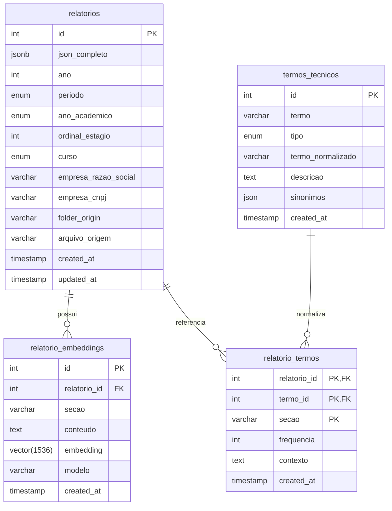
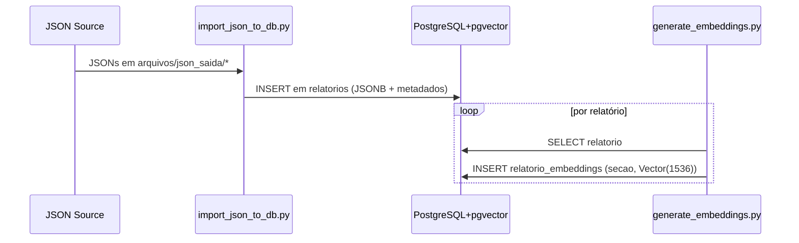
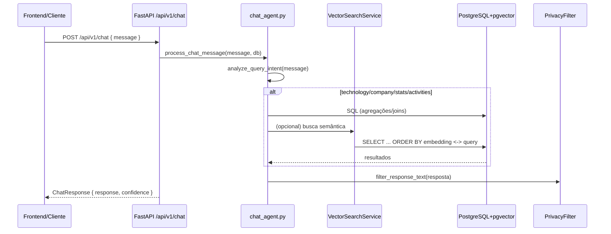

# Conversa Estágios — Modelo de Componentes do Backend

Este documento apresenta o modelo de componentes do backend, cobrindo: ETL, geração de embeddings, persistência em PostgreSQL (pgvector), fluxo de requisições, funcionamento dos agentes e resposta via FastAPI.

Sumário
- Visão geral dos componentes
- Diagrama de componentes
- ETL e ingestão de dados
- Geração e uso de embeddings
- Persistência e esquema de dados (PostgreSQL + pgvector)
- Serviços e API (FastAPI)
- Agentes (Pydantic AI) e fluxo de decisão
- Diagramas de sequência (ETL e Consulta)
- Runbook (como executar)
- Próximos passos

## 1) Visão geral dos componentes

- ETL/Ingestão
  - scripts/init_database.py: inicializa banco e extensão pgvector; popula termos técnicos.
  - scripts/import_json_to_db.py: importa JSONs de relatórios (arquivos/json_saida/*) e extrai metadados.
- Embeddings
  - scripts/generate_embeddings.py: gera embeddings (gemini-embedding-001) e persiste em relatorio_embeddings (Vector(1536)).
  - backend/app/services/vector_search.py: busca semântica via operador <-> do pgvector.
- Persistência (SQLAlchemy + PostgreSQL + pgvector)
  - Tabelas: relatorios, relatorio_embeddings, termos_tecnicos, relatorio_termos, chat_sessions, chat_messages.
- API e Serviços (FastAPI)
  - backend/main.py: app FastAPI, CORS, health, routers.
  - backend/app/api/chat.py: POST /api/v1/chat — orquestra agente e retorna ChatResponse.
  - backend/app/api/reports.py: POST /api/v1/reports/search — busca (termos/semântica + filtros); GET /api/v1/reports/{id} com filtro de privacidade.
  - backend/app/api/stats.py: POST /api/v1/stats — estatísticas agregadas; GET /api/v1/stats/summary.
  - backend/app/services/privacy_filter.py: sanitiza PII em textos/JSONs.
- Agentes
  - backend/app/agents/chat_agent.py: Pydantic AI Agent (OpenAIModel quando OPENAI_API_KEY setado; fallback TestModel). Faz análise de intenção (keywords), monta consultas SQL/semânticas, compõe resposta.

## 2) Diagrama de componentes

```mermaid
flowchart LR
    subgraph Data
        A[Arquivos JSON\narquivos/json_saida/*]
    end

    subgraph ETL
        B[import_json_to_db.py\nExtrai metadados\nCria registros em 'relatorios']
        C[generate_embeddings.py\nGera embeddings 1536d\npara seções]
    end

    subgraph DB[PostgreSQL + pgvector]
        D[(relatorios\nJSONB + metadados)]
        E[(relatorio_embeddings\nVector(1536))]
        F[(termos_tecnicos)]
        G[(relatorio_termos)]
        H[(chat_sessions, chat_messages)]
    end

    subgraph API[FastAPI]
        I[/chat.py\nPOST /api/v1/chat/]
        J[/reports.py\nPOST /search\nGET /{id}]
        K[/stats.py\nPOST /\nGET /summary]
        L[PrivacyFilter]
        M[VectorSearchService]
    end

    subgraph Agents
        N[chat_agent.py\nPydantic AI Agent\nAnalyze Intent -> Query]
    end

    A --> B --> D
    D --> C --> E

    I --> N
    N -->|SQL/Vector| D
    N -->|Vector| E
    N --> M
    J --> M --> D
    M --> E
    I --> L
    J --> L

    classDef db fill:#f5faff,stroke:#4c77b6,stroke-width:1px;
    classDef api fill:#f8fff5,stroke:#5b8c4a,stroke-width:1px;
    classDef etl fill:#fffaf5,stroke:#b67a4c,stroke-width:1px;
    class D,E,F,G,H db;
    class I,J,K,L,M api;
    class B,C etl;
```

## 3) ETL e ingestão de dados

- scripts/init_database.py
  - Cria DB (se não existir), habilita extensão pgvector (CREATE EXTENSION IF NOT EXISTS vector), cria tabelas via SQLAlchemy Metadata.
  - Popula termos_tecnicos (linguagens, frameworks, ferramentas, plataformas, bancos de dados, técnicas e tipos de projeto) com normalização termo_normalizado.
- scripts/import_json_to_db.py
  - Varre arquivos/json_saida/<folder>/*.json.
  - Extrai metadados do nome da pasta (padrão 2025-2Q-3roAno-1): ano, periodo (Enum 1Q/2Q/3Q/1S/2S), ano_academico (2°, 3°, 4°, 5°), ordinal_estagio.
  - Determina curso (Computação quadrimestral; Elétrica semestral; fallback por campo no JSON).
  - Persiste em relatorios.json_completo (JSONB) + colunas de metadados e empresa (razao_social, cnpj). Evita duplicados por arquivo_origem/folder_origin.

Observação: O ETL de PDF->JSON está fora deste repositório; aqui assumimos JSONs já gerados.

## 4) Geração e uso de embeddings

- scripts/generate_embeddings.py
  - Concatena conteúdo por seção:
    - sobre_empresa (texto livre)
    - atividades_realizadas (descrição, tarefas, papel, aprendizados, comentários)
    - conclusao
  - Gera embeddings usando Google GenAI (gemini-embedding-001) com dimensionalidade 1536 e grava em relatorio_embeddings: (relatorio_id, secao, conteudo truncado, embedding Vector(1536), modelo).
- backend/app/services/vector_search.py
  - Busca semântica via SQL raw com operador <-> (menor distância = mais similar); converte distância em similaridade 1/(1+distância) quando necessário.
  - Suporta filtros (ano, curso, período, empresa) e também busca por termos técnicos via tabelas normalizadas (relatorio_termos/termos_tecnicos).

## 5) Persistência e esquema (PostgreSQL + pgvector)

Principais tabelas (SQLAlchemy, backend/app/models/models.py):
- relatorios
  - json_completo (JSONB), ano, periodo (Enum), ano_academico (Enum), ordinal_estagio, curso (Enum), empresa_razao_social, empresa_cnpj, folder_origin, arquivo_origem, timestamps.
  - Relacionamentos: embeddings, termos.
- relatorio_embeddings
  - relatorio_id (FK), secao, conteudo (Text), embedding Vector(1536), modelo, created_at.
- termos_tecnicos e relatorio_termos
  - normalização de termos e relacionamento N:N com relatórios (inclui secao e frequencia/contexto).
- chat_sessions e chat_messages
  - suporte para histórico de conversas (opcional no fluxo atual).

Diagrama lógico (simplificado):



## 6) Serviços e API (FastAPI)

- backend/main.py
  - Registra routers: /api/v1/chat, /api/v1/reports, /api/v1/stats; CORS; health check; valida conexão com DB no startup.
- /api/v1/chat (backend/app/api/chat.py)
  - POST /. Entrada: ChatRequest. Aciona process_chat_message(...) do agente e retorna ChatResponse.
- /api/v1/reports (backend/app/api/reports.py)
  - POST /search: faz matching por termos técnicos (termos_tecnicos) e/ou fallback por ILIKE no JSON/texto, com filtros (ano, curso). Usa VectorSearchService quando aplicável.
  - GET /{id}: retorna relatório com filtro de privacidade (PrivacyFilter.filter_report_data).
- /api/v1/stats (backend/app/api/stats.py)
  - POST /: métricas como top_technologies, top_companies, reports_by_year/course, technologies_by_type etc.
  - GET /summary: agregados rápidos (total_reports, por ano/curso).
- Privacy: backend/app/services/privacy_filter.py — remove e-mails, telefones, CPF e reduz dados pessoais do bloco estagiario/supervisor.

## 7) Agentes (Pydantic AI) e fluxo de decisão

- backend/app/agents/chat_agent.py
  - Model: OpenAIModel('gpt-4o-mini') quando OPENAI_API_KEY presente; caso contrário, TestModel (mock) para desenvolvimento.
  - analyze_query_intent(message): análise por keywords (technology/company/statistics/activities, tipo de tecnologia, empresa, ano, "menos" -> ordenação ascendente, e detecção de tecnologia específica para busca reversa).
  - execute_complex_query(db, intent): encaminha para funções especializadas:
    - get_top_technologies, get_top_companies, get_companies_by_technology (reversa), get_activities_by_company (usa conteúdo de embeddings por secao), search_general.
  - analyze_activities_patterns: agrega atividades, cruza com termos técnicos do DB e produz análise sintética (placeholder de LLM para insights adicionais).
  - Garante privacidade e formata respostas com confiança (confidence score).

## 8) Diagramas de sequência

8.1) ETL (Ingestão + Embeddings)



8.2) Consulta via Chat



## 9) Runbook (como executar)

Pré-requisitos
- Docker (para Postgres com pgvector) ou Postgres local com extensão vector instalada.
- Python 3.10+
- Variáveis .env (opcional): DATABASE_URL, OPENAI_API_KEY (se quiser usar LLM real), GEMINI_API_KEY (para embeddings, se for gerar novamente).

Passos
1) Subir Postgres com pgvector
   - docker-compose up -d
2) Inicializar banco e termos técnicos
   - python scripts/init_database.py
3) Importar relatórios JSON
   - python scripts/import_json_to_db.py
4) (Opcional) Gerar embeddings
   - python scripts/generate_embeddings.py
5) Rodar a API
   - uvicorn backend.main:app --reload --port 8000

Conversões (Markdown -> PDF/PPTX) usando pandoc
- PDF: pandoc docs/ModeloComponentes.md -o docs/ModeloComponentes.pdf --from gfm -V geometry:margin=1in
- PPTX: pandoc docs/ModeloComponentes.md -o docs/ModeloComponentes.pptx --from gfm

Observação: É necessário ter pandoc instalado (brew install pandoc no macOS) e, para PDF via LaTeX, um engine como BasicTeX/MacTeX.

## 10) Próximos passos

- Implementar geração de embedding via serviço configurável (flag para OpenAI/Gemini) e retries/observabilidade estruturados.
- Ampliar VectorSearchService para busca híbrida (termos + vetores) e ajustar normalização de termos.
- Adicionar testes de integração para o fluxo completo do agente (já há testes para DB/pgvector).
- Adicionar cache para consultas frequentes e paginação para listagens.
- Evoluir análise de intenção para LLM grounded com validação e toolformer (ou usar regex+grammars mais robustas).
